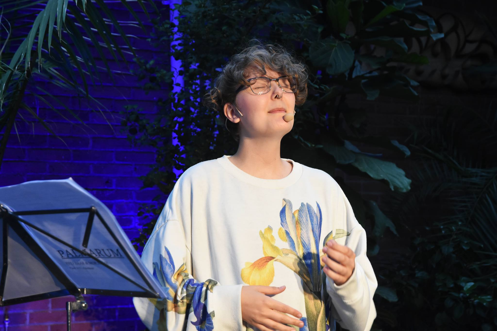

# Om Frej - ENGELSKA

Frej Haar är en dansk-svensk spoken word-poet född i Köpenhamn, i dag baserad i Göteborg. Hen vann svenska mästerskapet i poetry slam 2017, efter att ha blivit Uppsalamästare. Samma höst vann hen europeiska mästerskapet i Bryssel. Frej är utbildad bebyggelseantikvarie och lånar ofta tematik från kulturvårdsfältet. Annars skriver hen om de utsuddade linjerna och det vardagsbetraktande gränslösa genom att konstruera narrativ som ifrågasätter den fasta tillvaron, dess manliga författare och det inneboende. Hen talar transperspektiv och lesbiskhet, arven och skammen, orken och dess kvinnor. Det är sånger som aldrig kom hem.

Sedan 2016 har Frej självpublicerat diktfanzines, men även blivit publicerad i bl.a. norska queerkulturmagasinet MELK. I dag håller hen workshops, uppträder och skriver på sitt diktmanus.

Frej skriver poesi på engelska, svenska och danska (sitt modersmål). Sedan sina första poetry slam har hen hunnit uppträda på scener i Oslo (Det Norske Teatret), Stockholm (Dramaten), Uppsala (Reginateatern och Ordsprak), Luleå, Bryssel, Göteborg (Folkteatern, Palmarum), Köpenhamn och flera därtill. Med sin bakgrund inom kulturvård har Frej uppträtt på konferenser om kulturvårds- och stadsutvecklingstematiserade ämnen på bland annat Boverkets utvecklingsdagar samt Sveriges Byggindustriers och Fastighetsägarnas Bygg- och Utvecklingsbench 2018.
