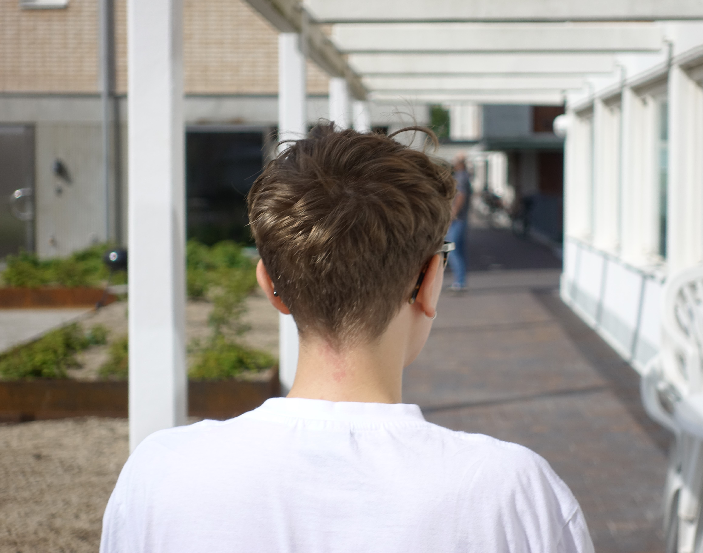

<i>I tell stories 
it is your choice 
to listen 
    -- </i>

 
Frej Haar is a Danish-Swedish spoken word-poet born in Copenhagen, based in Gothenburg. They won the Swedish Poetry Slam Championship 2017, went on to win the title of the European Champion in Brussels and then we arrived here. With roots in heritage studies, Frej touches themes of remembering, politics, the environment, biology, Flatland, urban development, (architectural) history, (dis)ability, gender and sexuality, whatever comes their way. Sometimes described as a wavering natural disaster, Frej mixes irony with vulnerable sincerity, leaving few behind. 

Performing in Swedish, Danish and English, they have performed in several countries, conferences, events and festivals since 2016. They also make fanzines/chapbooks, available through contact. Frej has been published in the Nordic queer culture magazine [MELK](https://www.melkmag.com/) and regularly writes and performs commissioned poems for conferences, most recently the Adventure Travel World Summit held in Gothenburg in September 2019. 

A full-time grad student, they host workshops, perform, write, work as one of the MCs (Master of Ceremonies) for the poetry slams in Gothenburg, and is the other half of the Swedish podcast IBSFM.
