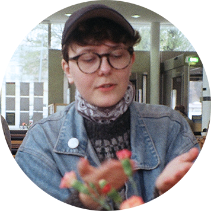

Frej Haar is a Danish-Swedish spoken word-poet born in Copenhagen, based in Gothenburg. They won the Swedish Poetry Slam Championship 2017, and then went on to win the title of the European Champion in Brussels. With roots in heritage studies, Frej touches themes of remembering, politics, the environment, biology, Flatland, urban development, (architectural) history, exhaustion, disability, gender and sexuality. Sometimes described as a wavering natural disaster, Frej mixes irony with vulnerable sincerity, leaving few behind. 

Performing in Swedish, Danish and English, they have performed in several countries, conferences, events and festivals since 2016. They also create fanzines, available through contact.
