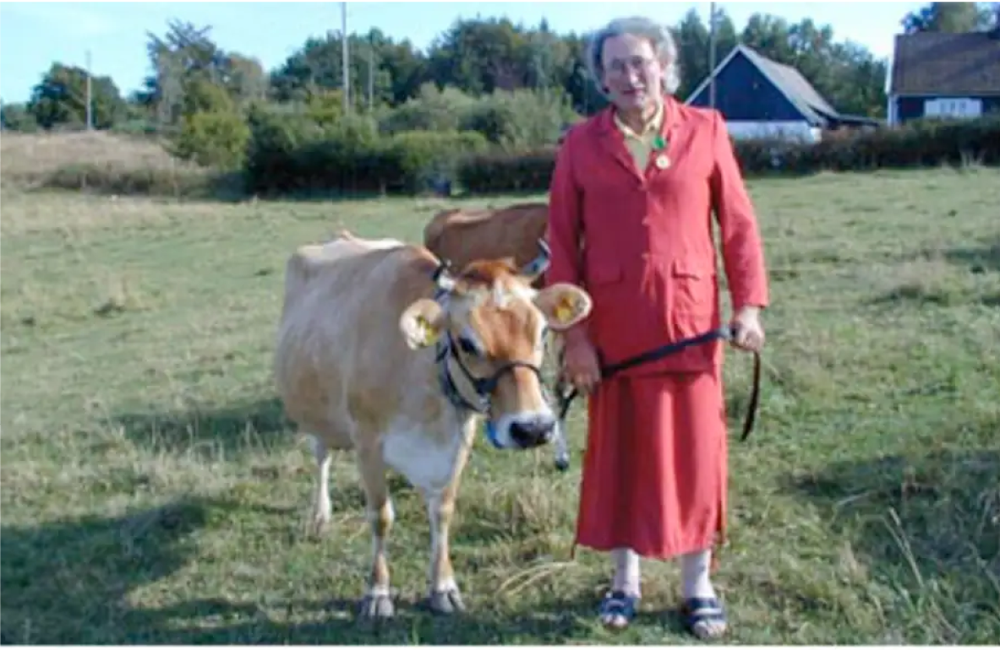

    -- </i>

    Frej Haar (they/them, b. 1996) is a Danish-Swedish poet and writer based in Malmö. In 2017, they won the Swedish National Poetry Slam Championship as well as the following European Championship in Brussels, Belgium. Their essays and poetry have been published in several Scandinavian and Swedish literary journals. Haar has a background in heritage and conservation studies, and has attended Kvinnofolkhögskolan's writing courses Your Silence Will Not Protect You as well as the writing program at Skurups folkhögskola. They are currently working on finishing a book of poetry about yarn, women, sheep and language.

    Frej writes and performs in Swedish and English and has performed in several countries since 2016. They also create fanzines/chapbooks, available for sale through contact. Preferred themes: queer heritage and history, women, (trans)gender and sexuality, biology, handicrafts and working class perspectives.

    

    <b>"Longing for Karin Lindgren"</b>   Knut Karin Lindgren (1949–2011) was a dairy farmer and subject of Swedish film-maker Rebecka Rasmusson’s 2010 documentary short film <i>En bondes längtan</i> (translation: A Farmer’s Desire). Lindgren lived her entire life in the small village of Sankt Olof, located in the southern part of
Sweden. Lindgren realised and came out as trans late in life. When seeking care to receive gender affirming treatment, she was asked to “dress as a woman” for five years to “see how she’d feel.” 

   Lindgren was awarded the Federation of Swedish Farmers’ gold medal for 23 years of delivering exceptional quality milk in 2002. Karin: ”<i>It was crown princess Victoria who presented the medal, it’s probably not every day she gets to meet a woman dressed in a skirt with the name Knut.</i>” Lindgren passed away shortly after the premiere of the film and was buried under her birthname.

    "Longing for Karin Lindgren" was exhibited at the Nordic Trans Studies Conference 2023 in Tampere University between 23rd and 25th of February 2023. Read work <a href="frejhaar.se/long-for-karin-lindgren.html">here</a>.
