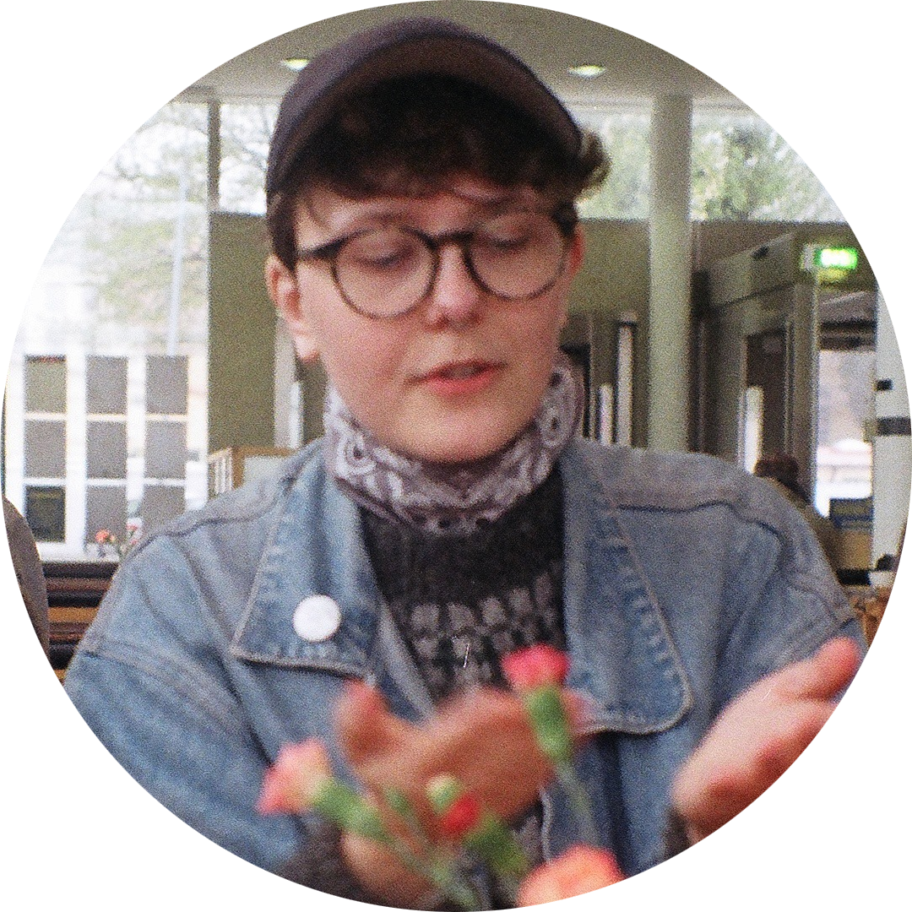

    
    
Foto: Alice Hedström

jag vill stöpa om ljuset 
stöpa könet i plast 
jag vill rädda mig själv från det onda 
amen 
             --  

 
Frej Haar är en dansk-svensk spoken word-poet född i Köpenhamn, baserad i Göteborg. Hen äntrade den svenska poetry slam-scenen en mörk vinter 2014 och blev svensk och europeisk mästare 2017. Tematiken rör allt från gemenskapen till plasten, politiken, (arkitektur)historia, kulturarv, Flatland och längtan efter ikoner som gått bort. 

Sedan 2016 har Frej självpublicerat diktfanzines, och även blivit publicerad i bl.a. norska queerkulturmagasinet MELK. I dag håller hen workshops, uppträder och skriver på sitt diktmanus ovanpå masterstudier.

Frej skriver poesi på engelska, svenska och danska. Sedan sina första poetry slam har hen hunnit uppträda på scener i Oslo (Det Norske Teatret), Stockholm (Dramaten), Uppsala (Reginateatern och Ordsprak), Luleå, Bryssel, Göteborg (Folkteatern, Palmarum), Köpenhamn och flera därtill. Med sin bakgrund inom kulturvård har Frej uppträtt på konferenser om kulturvårds- och stadsutvecklingstematiserade ämnen på bland annat Boverkets utvecklingsdagar samt Sveriges Byggindustriers och Fastighetsägarnas Bygg- och Utvecklingsbench 2018.
