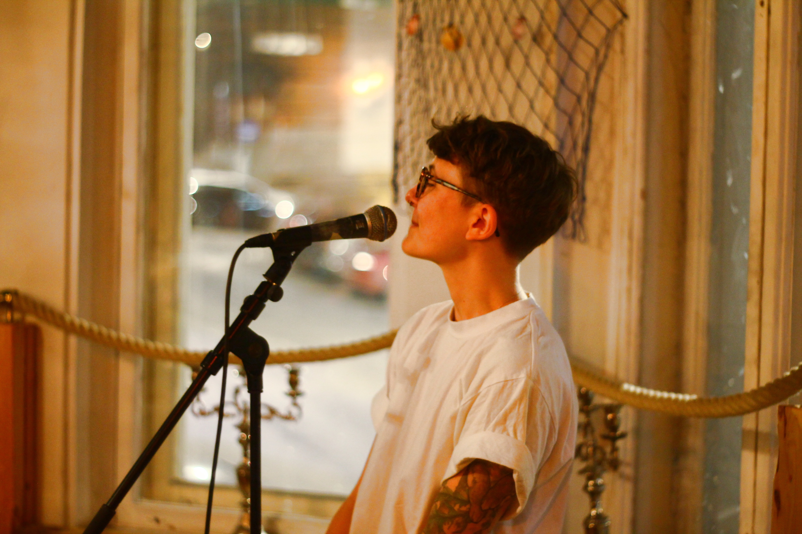
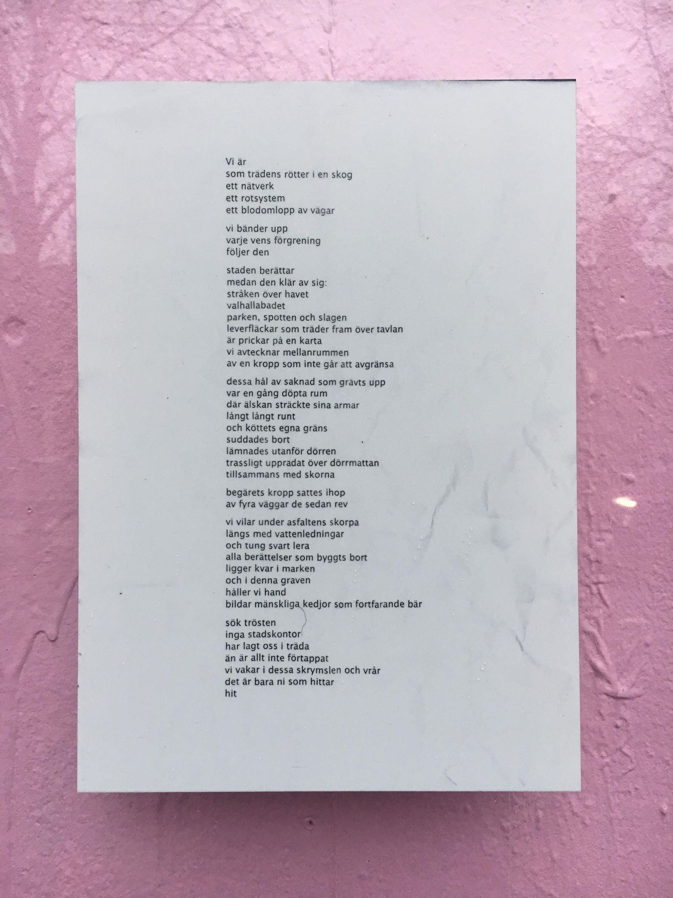

    

<i>jag vill stöpa om ljuset 
stöpa könet i plast 
jag vill rädda mig själv från det onda 
amen 
    -- </i>

 
Frej Haar är en dansk-svensk spoken word-poet född i Köpenhamn, baserad i Malmö. Hen äntrade den svenska poetry slam-scenen en mörk vinter 2014 och blev svensk och europeisk mästare 2017. Tematiken rör allt från gemenskapen till plasten, politiken, minnet och arvet men allra främst - hästtjejer.

Sedan 2016 har Frej självpublicerat diktfanzines, och även blivit publicerad i bl.a. norska queerkulturmagasinet [MELK](https://www.melkmag.com/). Hen har tidigare gått Kvinnofolkhögskolans skrivkurser Your Silence Will Not Protect You och går just nu Skrivarlinjen på Skurups folkhögskola.

Frej skriver poesi och texter på engelska, svenska och danska. Sedan sina första poetry slam har hen hunnit uppträda på scener i Oslo (Det Norske Teatret), Stockholm (Dramaten), Uppsala (Reginateatern och Ordsprak), Luleå, Bryssel, Göteborg (Folkteatern, Palmarum), Köpenhamn och flera därtill. Med sin bakgrund inom kulturvård har Frej uppträtt på konferenser om kulturvårds- och stadsutvecklingstematiserade ämnen på bland annat Boverkets utvecklingsdagar samt Sveriges Byggindustriers och Fastighetsägarnas Bygg- och Utvecklingsbench 2018.

 

    

    <b>Stadens ådror (2020)</b>

Mitt i en stad under stor förändring, pandemi och uppskjutet 400-årsjubileum faller vissa berättelser bort. I vissa fall osynliggörs de. I värsta fall raderas de aktivt, bl.a. genom att riva eller bygga bort viktiga platser. Osynligheten är däremot inte rotlös. Det finns ett hav av berättelser och historia under staden, om man bara ids att leta. I textens innehåll och de platser som nämns går det att läsa in andra röster och berättelser. Staden är inte bara queer. Den är också skapad av arbetet. Dikten lyfter det som visas upp mer sällan: livet, solidariteten och vår fortsatta kamps rötter.

Stadens ådror bestod av en 4,6 m rosa vägg där en plexiskiva med dikt sattes upp. Texten kom till under perioden jag skrev masteruppsats om kulturvårdens förståelse och attityder gentemot hbtq-kulturarv och perspektiv. Inom arbetet försökte jag kartlägga platser och byggnader med eventuellt potential att bevaras baserat på dess hbtq-historiska värde. Dikten är en tröts, ett försök att vidhålla minnen och information som dök upp i arkivmaterial från Queerrörelsens Arkiv och Bibliotek (QRAB) i Göteborg. Väggen fungerade också som en anslagstavla, där en lapp om Sam Hultins historieworkshops för Mitt Queera Göteborg sattes upp. [Mitt Queera Göteborg](https://www.facebook.com/Mitt-Queera-G%C3%B6teborg-106689931276260/), en [audioguide](https://izi.travel/browse/ac3eeb6d-4a43-4b07-961a-00edd3492843/sv) och stadsvandringar, var del av förstudien till det planerade monumentet över Göteborgs hbtq-historia.

Stadens ådror ställdes ut på Friplanket i Göteborg under okt - nov 2020.

 

    <b> Changemakers (2019) (beställningsverk)</b>

Beställningsverk för Adventure Travel Trade Associations Adventure Travel World Summit i september 2019. Diktuppträdande under keynote om ungas kraft och förändringspotential för framtiden. Mary Turner, redaktör vid [Outside Magazine](https://www.outsideonline.com/2402857/everything-our-editors-loved-september/) sa:

<i>“At the Adventure Travel Trade Association’s recent conference in Gothenburg, Sweden, I heard Danish-Swedish poet Frej Haar perform a poetry slam about the climate change crisis. Haar writes about trans activism, heritage, and other things close to their heart. Their words gave me chills, and people were both moved to tears and on their feet cheering Haar on.”</i>
 

    

 

    <b> Frej Haar & Mor Måne (2017)</b>

Poesi/ljudverk, framträdande Palmarum 9/6 2017. Arbetades fram med Mor Måne/Renée Gyllensvaan. Delar har senare framförts på andra scener, som Ordsprak (2017).
