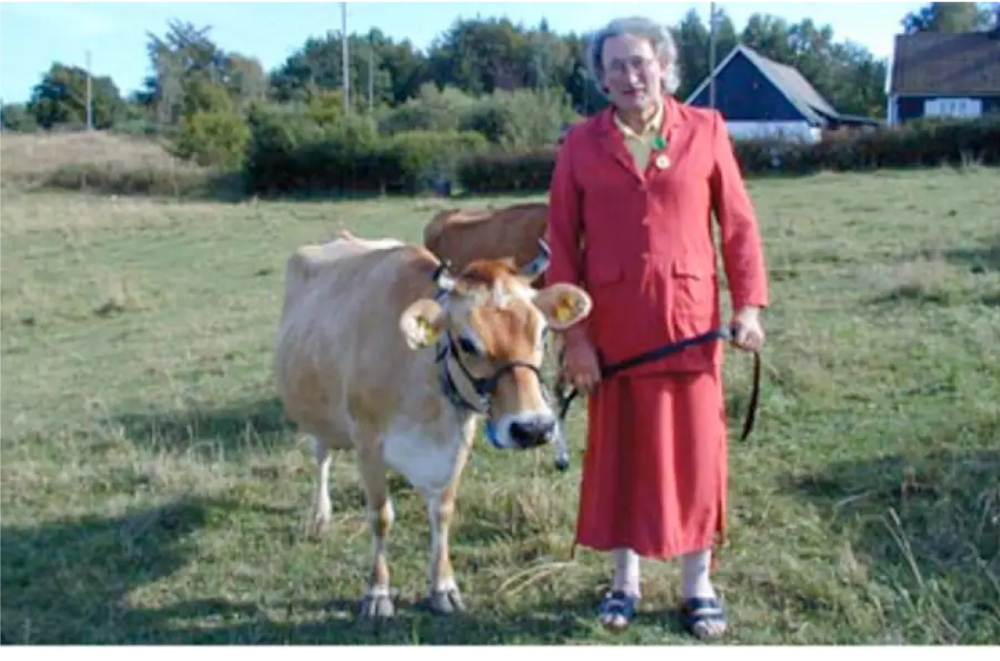

    Frej Haar (f. 1996) är dansk-svensk poet och prosaist utbildad inom kulturvård, bosatt i Malmö. Hen har tidigare gått Your Silence Will Not Protect You på Kvinnofolkhögskolan i Göteborg, skrivarlinjen på Skurups folkhögskola och Biskops Arnös författarskola. Hen debuterade 2024 med diktsamlingen <i></i>Bindepraktika</i>. 2017 blev hen svensk och europeisk mästare i poetry slam.

    Frej skriver på svenska och engelska. Hen har självpublicerat fanzines sedan 2016 och medverkat i tidskrifter som 20TAL, Kritiker, Ordkonst, Astra och <a href="https://www.melkmag.com/">MELK</a>. Hen har uppträtt på scener i flera europeiska länder samt deltagit i panelsamtal och konferenser både i Sverige och utomlands samt medverkat i tidskriften 20TAL:s AKT UNG!. Hen mottog stipendie från Helge Ax:son våren 2022 för ett pågående projekt.

    <b>Delar av en enhet / delar av en helhet</b>   Gestaltningsuppdrag för Kungsbacka Live, Kungsbacka kommuns nya mötesplats för medborgardialog. Delar av en enhet / delar av en helhet utgick från definitionen av ordet dialog, som alltid specificeras vara mellan två människor. Verket ville på så sätt undersöka hur och vem som räknas inom del av Kungsbackas dialog.

    

    

    <a href="https://frejhaar.se/long-for-karin-lindgren.html"><b>"Jag längtar efter Karin Lindgren längtar efter mig"</b></a>   Knut Karin Lindgren (1949–2011) var en mjölkbonde och huvudperson i Rebecka Rasmussons kortfilmsdokumentär <i>En bondes längtan</i> (2010). Lindgren levde hela sitt liv i Sankt Olof, en by på Österlen. Lindgren förstod och kom ut som trans sent i livet. När hon sökte vård uppmanades hon att "klä sig i kvinnokläder" i fem år för att "känna efter". Lindgren gick bort 2011 och begravdes under hennes födelsenamn.

    "Jag läntar efter Karin Lindgren längtar efter mig" ställdes ut under Nordic Trans Studies Conference 2023 vid Tammerfors universitet 23–25 februari 2023. Läs verket <a href="https://frejhaar.se/long-for-karin-lindgren.html">här</a>.

    <b>Stadens ådror (2020)</b>   Staden är inte bara queer. Den är också skapad av arbetet.  <i>Stadens ådror</i> bestod av en 4,6 m rosa vägg där en plexiskiva med dikt sattes upp. Dikten är ett försök att vidhålla minnen och information som dök upp i arkivmaterial från Queerrörelsens Arkiv och Bibliotek (QRAB) i Göteborg under masteruppsatsarbetet. Väggen fungerade också som en anslagstavla, där en lapp om Sam Hultins historieworkshops för Mitt Queera Göteborg sattes upp. <a href="https://www.facebook.com/Mitt-Queera-G%C3%B6teborg-106689931276260/">Mitt Queera Göteborg</a>, en <a href="https://izi.travel/browse/ac3eeb6d-4a43-4b07-961a-00edd3492843/sv">audioguide</a> och stadsvandringar, var del av förstudien till det planerade monumentet över Göteborgs hbtq-historia.

    Stadens ådror ställdes ut på Friplanket i Göteborg okt–nov 2020.

    

    <b> Frej Haar & Mor Måne (2017)</b>   Poesi/ljudverk, framträdande Palmarum 9/6 2017. Arbetades fram med Mor Måne/Renée Gyllensvaan med avstamp i diktsviten Snailchild. Delar har senare framförts på andra scener som Ordsprak (2017).

    
